# CLAUDE.md

This file provides guidance to Claude Code (claude.ai) when working with code in this repository.

## 变更记录 (Changelog)

- **2025-11-01**: 初始化架构师运行 - 完善文档结构，添加模块级 CLAUDE.md，创建 Mermaid 架构图，添加导航面包屑

## 项目概述

**Kube TUI** - 一个用 Rust 编写的 Kubernetes 终端 UI 工具。它提供了一个用于管理 Kubernetes 集群的 TUI 界面，灵感来自 lazydocker。

主要功能:
- 命名空间浏览和切换
- Pod、Service、Deployment、Job、DaemonSet、PVC、PV、Node、ConfigMap、Secret 管理
- 实时日志查看，支持自动刷新
- 资源描述查看
- YAML 配置查看
- 资源监控 (CPU/内存)
- 搜索功能
- 双模式交互: 文本选择模式和鼠标滚动模式
- 国际化支持 (中文/英文)

## 架构总览

```mermaid
graph TD
    A["Kube TUI"] --> B["src/main.rs"]
    A --> C["src/app.rs"]
    A --> D["src/events.rs"]
    A --> E["src/ui/"]
    A --> F["src/kubectl/"]
    A --> G["src/errors.rs"]
    A --> H["src/resource_type.rs"]

    E --> EI["ui/mod.rs"]
    E --> EL["ui/layout.rs"]
    E --> EC["ui/components/"]
    EC --> ECN["components/namespace_list.rs"]
    EC --> ECP["components/pod_list.rs"]
    EC --> ECS["components/service_list.rs"]
    EC --> ECD["components/deployment_list.rs"]
    EC --> ECJ["components/job_list.rs"]
    EC --> ECDC["components/daemonset_list.rs"]
    EC --> ECPV["components/pvc_list.rs"]
    EC --> ECPVV["components/pv_list.rs"]
    EC --> ECND["components/node_list.rs"]
    EC --> ECCM["components/configmap_list.rs"]
    EC --> ECSC["components/secret_list.rs"]
    EC --> ECT["components/top_view.rs"]
    EC --> ECL["components/logs.rs"]
    EC --> ECDS["components/describe.rs"]
    EC --> ECY["components/yaml_view.rs"]
    EC --> ECSR["components/search.rs"]
    EC --> ECCF["components/confirm.rs"]
    EC --> ECH["components/help.rs"]

    F --> FI["kubectl/mod.rs"]
    F --> FC["kubectl/client.rs"]
    F --> FCMD["kubectl/commands.rs"]
    F --> FT["kubectl/types.rs"]

    click B "./src/main.rs" "查看应用入口代码"
    click C "./src/app.rs" "查看应用状态管理代码"
    click D "./src/events.rs" "查看事件处理代码"
    click EI "./src/ui/mod.rs" "查看UI调度器代码"
    click EL "./src/ui/layout.rs" "查看布局管理代码"
    click FC "./src/kubectl/client.rs" "查看Kubernetes客户端代码"
    click FCMD "./src/kubectl/commands.rs" "查看kubectl命令构建器代码"
    click FT "./src/kubectl/types.rs" "查看类型定义代码"
    click G "./src/errors.rs" "查看错误定义"
    click H "./src/resource_type.rs" "查看资源类型枚举"
```

## 模块索引

| 模块路径 | 模块名称 | 描述 |
|---------|---------|------|
| src/ | 根模块 | 应用核心架构 |
| src/main.rs | 入口模块 | 应用启动和主事件循环 |
| src/app.rs | 应用状态模块 | 核心状态管理和模式管理 |
| src/events.rs | 事件处理模块 | 键盘、鼠标和调整大小事件轮询 |
| src/ui/ | UI 渲染模块 | TUI 界面渲染和布局管理 |
| src/ui/components/ | UI 组件模块 | 各个资源类型的列表和详情页面 |
| src/kubectl/ | Kubernetes 客户端模块 | 与 Kubernetes API 交互的封装 |
| src/kubectl/client.rs | 客户端实现 | KubectlClient 主实现 |
| src/kubectl/commands.rs | 命令构建器 | Kubectl 命令字符串构建 |
| src/kubectl/types.rs | 类型定义 | Kubernetes 资源数据结构 |
| src/errors.rs | 错误处理模块 | 应用特定错误类型 |
| src/resource_type.rs | 资源类型枚举 | 支持的 Kubernetes 资源类型 |

## 架构

### 核心模块

- `src/main.rs` - 应用入口点，终端设置，主事件循环
- `src/app.rs` - 核心应用状态 (`AppState`) 和模式管理 (`AppMode`)
- `src/events.rs` - 键盘、鼠标和调整大小事件轮询
- `src/kubectl/` - Kubernetes 客户端包装器
  - `client.rs` - KubectlClient - 执行 kubectl 命令
  - `commands.rs` - 命令构建器
  - `types.rs` - Kubernetes 资源的数据结构
- `src/ui/` - UI 渲染组件
  - `mod.rs` - 主 UI 调度器 (`render_ui`)
  - `layout.rs` - 布局管理
  - `components/` - 各个组件渲染器

### 关键设计模式

1. **状态管理**：集中式 `AppState` 结构体包含所有应用状态
2. **基于模式的 UI**：不同资源类型和操作有不同的视图
3. **自动刷新**：基于时间的自动数据刷新，具有可配置的间隔
4. **条件鼠标捕获**：仅在可滚动视图中启用鼠标捕获（通过 `M` 键配置）

## 运行与开发

### 常见命令

| 命令 | 描述 |
|---------|-------------|
| `cargo build` / `make build` | 构建调试版本 |
| `cargo build --release` / `make build-release` | 构建发布版本 |
| `cargo run` / `make dev` | 在开发模式下运行 |
| `cargo test` / `make test` | 运行单元测试 |
| `cargo clippy -- -D warnings` / `make lint` | 运行 linter |
| `cargo fmt` / `make format` | 格式化代码 |
| `make test-all` | 运行所有功能测试 |
| `make install` | 安装到系统路径 |

## 开发指南

### 添加新资源类型

1. 在 `src/kubectl/types.rs` 中添加类型
2. 在 `src/kubectl/client.rs` 中添加获取方法
3. 在 `src/app.rs` 中添加变体到 `AppMode`
4. 在 `src/ui/components/` 中创建组件
5. 在 `src/ui/mod.rs` 中连接渲染
6. 在主循环中添加数据加载

### 添加新键绑定

1. 在 `src/app.rs` 中的 `AppState::handle_key_event()` 中添加处理
2. 如有需要，更新 `src/ui/components/help.rs` 中的帮助文本
3. 为特定上下文更新 `src/ui/mod.rs` 中的页脚

### 国际化

- 检查 `app.language_chinese` 标志以确定显示语言
- 在 UI 组件中添加中英文文本
- 使用模式: `if app.language_chinese { "中文" } else { "English" }`

## 测试策略

- 单元测试放在相应的模块中
- 功能测试脚本在 `scripts/` 中
- 使用 `make test-all` 运行综合测试

## AI 使用指引

### 常用操作

| 操作 | 使用场景 | 建议代理 |
|------|----------|---------|
| 代码分析和理解 | 需要深入理解代码结构 | 架构师 |
| 功能实现 | 添加新功能或改进 | 规划师 + TDD 引导 |
| 代码审查 | 完成代码后 | 代码审查者 + Rust 审查者 |
| 安全分析 | 提交前 | 安全审查者 |
| 错误修复 | 构建失败或运行时错误 | 构建错误解决者 |

## 重要注意事项

- 应用程序使用 `ratatui` 进行 TUI 渲染，使用 `crossterm` 进行终端交互
- 鼠标捕获是有条件的：仅在可滚动视图（Logs, Describe, YamlView, TopView）中启用，并且在非文本选择模式下
- 自动刷新有多个独立控制：全局、列表、日志、描述、YAML
- `M` 键在文本选择模式和鼠标滚动模式之间切换
- `I` 键在中英文语言之间切换
- 始终使用 `KubectlClient` 与 Kubernetes 交互，而不是直接调用 kubectl
